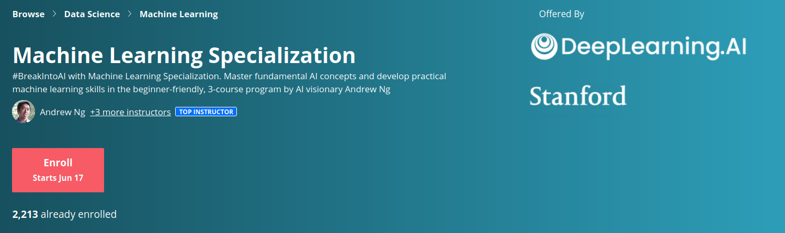

# Machine Learning Specialization Coursera

Contains Solutions and Notes for the [Machine Learning Specialization](https://www.coursera.org/specializations/machine-learning-introduction/?utm_medium=coursera&utm_source=home-page&utm_campaign=mlslaunch2022IN) by Andrew NG on Coursera 

## 本地学习材料与来源

- 本地个人学习笔记：[黄博士机器学习个人笔记完整版 v5.52.pdf](./黄博士机器学习个人笔记完整版v5.52.pdf)
- 来源仓库：[fengdu78/Coursera-ML-AndrewNg-Notes](https://github.com/fengdu78/Coursera-ML-AndrewNg-Notes)
- 说明：上述 PDF 是机器学习部分的个人学习笔记/参考资料，不是官方课程官网；本目录中的课程文件与笔记归档也不代表已经完成相应课程。

## 学习状态与后续安排

C1（Supervised Machine Learning: Regression and Classification）已学完；C2（Advanced Learning Algorithms）与 C3（Unsupervised Learning, Recommenders, Reinforcement Learning）暂缓。[李沐《动手学深度学习》（PyTorch）](../D2L-李沐/README.md)已学完；后续再按需恢复本专项课程。

以上是个人学习进度，不表示整个专项课程结业或取得认证。其余课程资料、示例输出和下方原仓库的课程回顾均保留为参考。

课程代码与原始导航参考：[greyhatguy007/Machine-Learning-Specialization-Coursera](https://github.com/greyhatguy007/Machine-Learning-Specialization-Coursera)，保留原仓库的 [LICENSE](./LICENSE)。个人 PDF 的来源独立列于上方。

**Note : If you would like to have a deeper understanding of the concepts by understanding all the math required, have a look at [Mathematics for Machine Learning and Data Science](https://github.com/greyhatguy007/Mathematics-for-Machine-Learning-and-Data-Science-Specialization-Coursera)**

## Course 1 : [Supervised Machine Learning: Regression and Classification ](https://www.coursera.org/learn/machine-learning?specialization=machine-learning-introduction)

- [Week 1](./C1%20-%20Supervised%20Machine%20Learning%20-%20Regression%20and%20Classification/week1)

    - [Practice quiz: Regression](./C1%20-%20Supervised%20Machine%20Learning%20-%20Regression%20and%20Classification/week1/Practice%20quiz%20-%20Regression)
    - [Practice quiz: Supervised vs unsupervised learning](./C1%20-%20Supervised%20Machine%20Learning%20-%20Regression%20and%20Classification/week1/Practice%20quiz%20-%20Supervised%20vs%20unsupervised%20learning)
    - [Practice quiz: Train the model with gradient descent](./C1%20-%20Supervised%20Machine%20Learning%20-%20Regression%20and%20Classification/week1/Practice%20quiz%20-%20Train%20the%20model%20with%20gradient%20descent)
  - [Optional Labs](./C1%20-%20Supervised%20Machine%20Learning%20-%20Regression%20and%20Classification/week1/Optional%20Labs)
    - [Model Representation](./C1%20-%20Supervised%20Machine%20Learning%20-%20Regression%20and%20Classification/week1/Optional%20Labs/C1_W1_Lab02_Model_Representation_Soln.ipynb)
    - [Cost Function](./C1%20-%20Supervised%20Machine%20Learning%20-%20Regression%20and%20Classification/week1/Optional%20Labs/C1_W1_Lab03_Cost_function_Soln.ipynb)
    - [Gradient Descent](./C1%20-%20Supervised%20Machine%20Learning%20-%20Regression%20and%20Classification/week1/Optional%20Labs/C1_W1_Lab04_Gradient_Descent_Soln.ipynb)

 

- [Week 2](./C1%20-%20Supervised%20Machine%20Learning%20-%20Regression%20and%20Classification/week2)

    - [Practice quiz: Gradient descent in practice](./C1%20-%20Supervised%20Machine%20Learning%20-%20Regression%20and%20Classification/week2/Practice%20quiz%20-%20Gradient%20descent%20in%20practice)
    - [Practice quiz: Multiple linear regression](./C1%20-%20Supervised%20Machine%20Learning%20-%20Regression%20and%20Classification/week2/Practice%20quiz%20-%20Multiple%20linear%20regression)
    - [Optional Labs](./C1%20-%20Supervised%20Machine%20Learning%20-%20Regression%20and%20Classification/week2/Optional%20Labs)
      - [Numpy Vectorization](./C1%20-%20Supervised%20Machine%20Learning%20-%20Regression%20and%20Classification/week2/Optional%20Labs/C1_W2_Lab01_Python_Numpy_Vectorization_Soln.ipynb)
      - [Multi Variate Regression](./C1%20-%20Supervised%20Machine%20Learning%20-%20Regression%20and%20Classification/week2/Optional%20Labs/C1_W2_Lab02_Multiple_Variable_Soln.ipynb)
      - [Feature Scaling](./C1%20-%20Supervised%20Machine%20Learning%20-%20Regression%20and%20Classification/week2/Optional%20Labs/C1_W2_Lab03_Feature_Scaling_and_Learning_Rate_Soln.ipynb)
      - [Feature Engineering](./C1%20-%20Supervised%20Machine%20Learning%20-%20Regression%20and%20Classification/week2/Optional%20Labs/C1_W2_Lab04_FeatEng_PolyReg_Soln.ipynb)
      - [Sklearn Gradient Descent](./C1%20-%20Supervised%20Machine%20Learning%20-%20Regression%20and%20Classification/week2/Optional%20Labs/C1_W2_Lab05_Sklearn_GD_Soln.ipynb)
      - [Sklearn Normal Method](./C1%20-%20Supervised%20Machine%20Learning%20-%20Regression%20and%20Classification/week2/Optional%20Labs/C1_W2_Lab05_Sklearn_GD_Soln.ipynb)
    - [Programming Assignment](./C1%20-%20Supervised%20Machine%20Learning%20-%20Regression%20and%20Classification/week2/C1W2A1)
      - [Linear Regression](./C1%20-%20Supervised%20Machine%20Learning%20-%20Regression%20and%20Classification/week2/C1W2A1/C1_W2_Linear_Regression.ipynb)

 

- [Week 3](./C1%20-%20Supervised%20Machine%20Learning%20-%20Regression%20and%20Classification/week3)

    - [Practice quiz: Cost function for logistic regression](./C1%20-%20Supervised%20Machine%20Learning%20-%20Regression%20and%20Classification/week3/Practice%20quiz%20-%20Cost%20function%20for%20logistic%20regression)
    - [Practice quiz: Gradient descent for logistic regression](./C1%20-%20Supervised%20Machine%20Learning%20-%20Regression%20and%20Classification/week3/Practice%20quiz%20-%20Gradient%20descent%20for%20logistic%20regression)
    - [本地练习资料：Classification with logistic regression](./C1%20-%20Supervised%20Machine%20Learning%20-%20Regression%20and%20Classification/week3/Practice%20quiz%20-%20Classification%20with%20logistic%20regression/Readme.md)
    - [本地练习资料：The problem of overfitting](./C1%20-%20Supervised%20Machine%20Learning%20-%20Regression%20and%20Classification/week3/Practise%20quiz%20-%20The%20problem%20of%20overfitting/Readme.md)
    - [Optional Labs](./C1%20-%20Supervised%20Machine%20Learning%20-%20Regression%20and%20Classification/week3/Optional%20Labs)
        - [Classification](./C1%20-%20Supervised%20Machine%20Learning%20-%20Regression%20and%20Classification/week3/Optional%20Labs/C1_W3_Lab01_Classification_Soln.ipynb)
        - [Sigmoid Function](./C1%20-%20Supervised%20Machine%20Learning%20-%20Regression%20and%20Classification/week3/Optional%20Labs/C1_W3_Lab02_Sigmoid_function_Soln.ipynb)
        - [Decision Boundary](./C1%20-%20Supervised%20Machine%20Learning%20-%20Regression%20and%20Classification/week3/Optional%20Labs/C1_W3_Lab03_Decision_Boundary_Soln.ipynb)
        - [Logistic Loss](./C1%20-%20Supervised%20Machine%20Learning%20-%20Regression%20and%20Classification/week3/Optional%20Labs/C1_W3_Lab04_LogisticLoss_Soln.ipynb)
        - [Cost Function](./C1%20-%20Supervised%20Machine%20Learning%20-%20Regression%20and%20Classification/week3/Optional%20Labs/C1_W3_Lab05_Cost_Function_Soln.ipynb)
        - [Gradient Descent](./C1%20-%20Supervised%20Machine%20Learning%20-%20Regression%20and%20Classification/week3/Optional%20Labs/C1_W3_Lab06_Gradient_Descent_Soln.ipynb)
        - [Scikit Learn - Logistic Regression](./C1%20-%20Supervised%20Machine%20Learning%20-%20Regression%20and%20Classification/week3/Optional%20Labs/C1_W3_Lab07_Scikit_Learn_Soln.ipynb)
        - [Overfitting](./C1%20-%20Supervised%20Machine%20Learning%20-%20Regression%20and%20Classification/week3/Optional%20Labs/C1_W3_Lab08_Overfitting_Soln.ipynb)
        - [Regularization](./C1%20-%20Supervised%20Machine%20Learning%20-%20Regression%20and%20Classification/week3/Optional%20Labs/C1_W3_Lab09_Regularization_Soln.ipynb)
    - [Programming Assignment](./C1%20-%20Supervised%20Machine%20Learning%20-%20Regression%20and%20Classification/week3/C1W3A1)
      - [Logistic Regression](./C1%20-%20Supervised%20Machine%20Learning%20-%20Regression%20and%20Classification/week3/C1W3A1/C1_W3_Logistic_Regression.ipynb)

 

## Course 2 : [Advanced Learning Algorithms](https://www.coursera.org/learn/advanced-learning-algorithms?specialization=machine-learning-introduction)

- [Week 1](./C2%20-%20Advanced%20Learning%20Algorithms/week1)
    - [Practice quiz: Neural networks intuition](./C2%20-%20Advanced%20Learning%20Algorithms/week1/Practice%20quiz%20-%20Neural%20networks%20intuition)
    - [Practice quiz: Neural network model](./C2%20-%20Advanced%20Learning%20Algorithms/week1/Practice%20quiz%20-%20Neural%20network%20model)
    - [Practice quiz: TensorFlow implementation](./C2%20-%20Advanced%20Learning%20Algorithms/week1/Practice%20quiz%20-%20TensorFlow%20implementation)
    - [Practice quiz : Neural Networks Implementation in Numpy](./C2%20-%20Advanced%20Learning%20Algorithms/week1/Practice-Quiz-Neural-Networks-Implementation-in-python)
    - [Optional Labs](./C2%20-%20Advanced%20Learning%20Algorithms/week1/optional-labs)
      - [Neurons and Layers](./C2%20-%20Advanced%20Learning%20Algorithms/week1/optional-labs/C2_W1_Lab01_Neurons_and_Layers.ipynb)
      - [Coffee Roasting](./C2%20-%20Advanced%20Learning%20Algorithms/week1/optional-labs/C2_W1_Lab02_CoffeeRoasting_TF.ipynb)
      - [Coffee Roasting Using Numpy](./C2%20-%20Advanced%20Learning%20Algorithms/week1/optional-labs/C2_W1_Lab02_CoffeeRoasting_TF.ipynb)
    - [Programming Assignment](./C2%20-%20Advanced%20Learning%20Algorithms/week1/C2W1A1)
      - [Neural Networks for Binary Classification](./C2%20-%20Advanced%20Learning%20Algorithms/week1/C2W1A1/C2_W1_Assignment.ipynb)
  

   

- [Week 2](./C2%20-%20Advanced%20Learning%20Algorithms/week2)
    - [Practice quiz : Neural Networks Training](./C2%20-%20Advanced%20Learning%20Algorithms/week2/Practice-Quiz-Neural-Network-Training)
    - [Practice quiz : Activation Functions](./C2%20-%20Advanced%20Learning%20Algorithms/week2/Practice-Quiz-Activation-Functions)
    - [Practice quiz : Multiclass Classification](./C2%20-%20Advanced%20Learning%20Algorithms/week2/Practice-quiz-Multiclass-Classification)
    - [Practice quiz : Additional Neural Networks Concepts](./C2%20-%20Advanced%20Learning%20Algorithms/week2/Practice-Quiz-Additional-Neural-Network-Concepts)
    - [Optional Labs](./C2%20-%20Advanced%20Learning%20Algorithms/week2/optional-labs)
        - [RElu](./C2%20-%20Advanced%20Learning%20Algorithms/week2/optional-labs/C2_W2_Relu.ipynb)
        - [Softmax](./C2%20-%20Advanced%20Learning%20Algorithms/week2/optional-labs/C2_W2_SoftMax.ipynb)
        - [Multiclass Classification](./C2%20-%20Advanced%20Learning%20Algorithms/week2/optional-labs/C2_W2_Multiclass_TF.ipynb)
    - [Programming Assignment](./C2%20-%20Advanced%20Learning%20Algorithms/week2/C2W2A1)
      - [Neural Networks For Handwritten Digit Recognition - Multiclass](./C2%20-%20Advanced%20Learning%20Algorithms/week2/C2W2A1/C2_W2_Assignment.ipynb)
    

 

- [Week 3](./C2%20-%20Advanced%20Learning%20Algorithms/week3)
    - [Practice quiz : Advice for Applying Machine Learning](./C2%20-%20Advanced%20Learning%20Algorithms/week3/Practice-Quiz-Advice-for-applying-machine-learning)
    - [Practice quiz : Bias and Variance](./C2%20-%20Advanced%20Learning%20Algorithms/week3/practice-quiz-bias-and-variance)
    - [Practice quiz : Machine Learning Development Process](./C2%20-%20Advanced%20Learning%20Algorithms/week3/practice-quiz-machine-learning-development-process)
    - [Programming Assignment](./C2%20-%20Advanced%20Learning%20Algorithms/week3/C2W3A1)
        - [Advice for Applied Machine Learning](./C2%20-%20Advanced%20Learning%20Algorithms/week3/C2W3A1/C2_W3_Assignment.ipynb)

 

- [Week 4](./C2%20-%20Advanced%20Learning%20Algorithms/week4)
    - [Practice quiz : Decision Trees](./C2%20-%20Advanced%20Learning%20Algorithms/week4/practice-quiz-decision-trees)
    - [Practice quiz : Decision Trees Learning](./C2%20-%20Advanced%20Learning%20Algorithms/week4/practice-quiz-decision-tree-learning)
    - [Practice quiz : Decision Trees Ensembles](./C2%20-%20Advanced%20Learning%20Algorithms/week4/practice-quiz-tree-ensembles)
    - [Programming Assignment](./C2%20-%20Advanced%20Learning%20Algorithms/week4/C2W4A1)
        - [Decision Trees](./C2%20-%20Advanced%20Learning%20Algorithms/week4/C2W4A1/C2_W4_Decision_Tree_with_Markdown.ipynb)

 

## Course 3 : [Unsupervised Learning, Recommenders, Reinforcement Learning](https://www.coursera.org/learn/unsupervised-learning-recommenders-reinforcement-learning?specialization=machine-learning-introduction)

 

- [Week 1](./C3%20-%20Unsupervised%20Learning%2C%20Recommenders%2C%20Reinforcement%20Learning/week1)
    - [Practice quiz : Clustering](./C3%20-%20Unsupervised%20Learning%2C%20Recommenders%2C%20Reinforcement%20Learning/week1/Practice%20Quiz%20-%20Clustering)
    - [Practice quiz : Anomaly Detection](./C3%20-%20Unsupervised%20Learning%2C%20Recommenders%2C%20Reinforcement%20Learning/week1/Practice%20Quiz%20-%20Anomaly%20Detection)
    - [Programming Assignments](./C3%20-%20Unsupervised%20Learning%2C%20Recommenders%2C%20Reinforcement%20Learning/week1/C3W1A)
        - [K means](./C3%20-%20Unsupervised%20Learning%2C%20Recommenders%2C%20Reinforcement%20Learning/week1/C3W1A/C3W1A1/C3_W1_KMeans_Assignment.ipynb)
        - [Anomaly Detection](./C3%20-%20Unsupervised%20Learning%2C%20Recommenders%2C%20Reinforcement%20Learning/week1/C3W1A/C3W1A2/C3_W1_Anomaly_Detection.ipynb)

 

- [Week 2](./C3%20-%20Unsupervised%20Learning%2C%20Recommenders%2C%20Reinforcement%20Learning/week2)
    - [Practice quiz : Collaborative Filtering](./C3%20-%20Unsupervised%20Learning%2C%20Recommenders%2C%20Reinforcement%20Learning/week2/Practice%20Quiz%20-%20Collaborative%20Filtering)
    - [Practice quiz : Recommender systems implementation](./C3%20-%20Unsupervised%20Learning%2C%20Recommenders%2C%20Reinforcement%20Learning/week2/Practice%20Quiz%20-%20Recommender%20systems%20implementation)
    - [Practice quiz : Content-based filtering](./C3%20-%20Unsupervised%20Learning%2C%20Recommenders%2C%20Reinforcement%20Learning/week2/Practice%20Quiz%20-%20Content-based%20filtering)
    - [Programming Assignments](./C3%20-%20Unsupervised%20Learning%2C%20Recommenders%2C%20Reinforcement%20Learning/week2/C3W2)
        - [Collaborative Filtering RecSys](./C3%20-%20Unsupervised%20Learning%2C%20Recommenders%2C%20Reinforcement%20Learning/week2/C3W2/C3W2A1/C3_W2_Collaborative_RecSys_Assignment.ipynb)
        - [RecSys using Neural Networks](./C3%20-%20Unsupervised%20Learning%2C%20Recommenders%2C%20Reinforcement%20Learning/week2/C3W2/C3W2A2/C3_W2_RecSysNN_Assignment.ipynb)

 

- [Week 3](./C3%20-%20Unsupervised%20Learning%2C%20Recommenders%2C%20Reinforcement%20Learning/week3)
    - [Practice quiz : Reinforcement learning introduction](./C3%20-%20Unsupervised%20Learning%2C%20Recommenders%2C%20Reinforcement%20Learning/week3/Practice%20Quiz%20-%20Reinforcement%20learning%20introduction)
    - [Practice Quiz : State-action value function](./C3%20-%20Unsupervised%20Learning%2C%20Recommenders%2C%20Reinforcement%20Learning/week3/Practice%20Quiz%20-%20State-action%20value%20function)
    - [Practice Quiz : Continuous state spaces](./C3%20-%20Unsupervised%20Learning%2C%20Recommenders%2C%20Reinforcement%20Learning/week3/Practice%20Quiz%20-%20Continuous%20state%20spaces)
    - [Programming Assignment](./C3%20-%20Unsupervised%20Learning%2C%20Recommenders%2C%20Reinforcement%20Learning/week3/C3W3A1)
        - [Deep Q-Learning - Lunar Lander](./C3%20-%20Unsupervised%20Learning%2C%20Recommenders%2C%20Reinforcement%20Learning/week3/C3W3A1/C3_W3_A1_Assignment.ipynb)

 

 

### 原资料仓库的课程回顾与示例

以下回顾、演示视频和推荐系统示例来自原资料仓库，保留用于了解课程内容，不代表本仓库作者已完成 C2/C3 或复现了这些项目。

This Course is a best place towards becoming a Machine Learning Engineer. Even if you're an expert, many algorithms are covered in depth such as decision trees which may help in further improvement of skills.

**Special thanks to [Professor Andrew Ng](https://www.andrewng.org/) for structuring and tailoring this Course.**

 

#### An insight of what you might be able to accomplish at the end of this specialization :

* <i>Write an unsupervised learning algorithm to **Land the Lunar Lander** Using Deep Q-Learning</i>

    - The Rover was trained to land correctly on the surface, correctly between the flags as indicators after many unsuccessful attempts in learning how to do it.
    - The final landing after training the agent using appropriate parameters : 

https://user-images.githubusercontent.com/77543865/182395635-703ae199-ba79-4940-86eb-23dd90093ab3.mp4

* <i>Write an algorithm for a **Movie Recommender System**</i>
    
    - A movie database is collected based on its genre.
    - A content based filtering and collaborative filtering algorithm is trained and the movie recommender system is implemented.
    - It gives movie recommendentations based on the movie genre.

* <i> And Much More !! </i>

Concluding, this is a course which I would recommend everyone to take. Not just because you learn many new stuffs, but also the assignments are real life examples which are *exciting to complete*. 

 

**Happy Learning :))**

 
 
