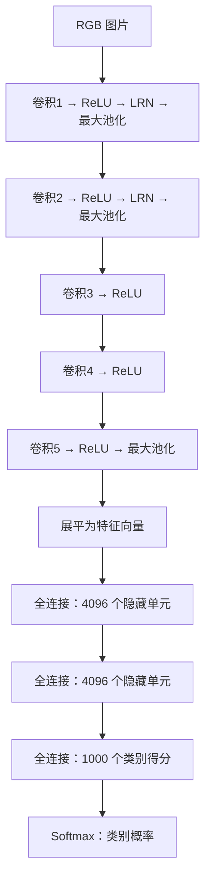

# First Time
## Abstract :
工作：用**DCNN** 把120万张高分辨率图片划分为1000类
构成：**6000万参数**和**65万神经元**；**五个卷积层，三个全连接层**，部分卷积层后接最大**池化层**；网络末端1000个类别的Softmax输出层
**方法：**采用具有非饱和特性的神经元，并为卷积运算实现高效**GPU**计算；采用[**Dropout**](https://en.wikipedia.org/wiki/Dropout_(neural_networks))正则化方法减轻全连接层过拟合
结果：15.3%Top-5测试错误率，<u>远高于第二名26.2%</u>
*偏报告向摘要*

## Conclusion :
无

## *Discussion* :
结果：足够大的**DCNN**，可通过**监督学习**，在复杂的大规模图像分类任务上取得很强的效果。删除卷积层会损害性能，支持了**深度**对这套模型的重要性。
愿景：希望继续扩大网络、延长训练，并利用**视频**的时间信息。

## Figure :
#### Fig1:
横轴训练轮数，纵轴训练错误率；[**Rectified linear unit (RTLU)**](https://en.wikipedia.org/wiki/Rectified_linear_unit)曲线更快下降，六倍于**tanh**
	结论：支持特定设置下的优化速度优势
	边界：但没有直接证明测试泛化更强

#### Fig2：
两张 GPU 的分工、通道数量、跨卡连接
	结论：展示一个网络如何被拆分；两路之间并非完全独立

#### Fig3：
第一层学习出的 96 个卷积核
	结论：可以看到方向性纹理和彩色斑块；这些模式来自学习
#### Fig4：
左侧分类候选，右侧按最后隐藏层特征寻找近邻
	边界：展示有意义的预测与特征相似性，但只是定性案例
	*检索使用是最后隐藏层的 **4096 维特征向量之间的欧氏距离**。姿态不同的狗、大象仍可能彼此接近，说明这种表示捕捉到了一些比逐像素相似更有用的信息。*

## Table：
#### Table 1：
相对表中更强的已有方法，Top-5 错误率下降了 **8.7 个百分点**。
	37.5%／17.0% 使用了十视图预测平均；不使用这一操作时，是 39.0%／18.3%。
#### Table 2：
**著名的 15.3%，属于最后这套集成方案。** 其中预训练模型先在更大的 ImageNet 数据上学习，并增加了一个卷积层，再针对竞赛任务微调。它相对第二名降低了 **10.9 个百分点**。

# Second Time
## 1.Introduction
现实中的图像识别很难。*同样是一只狗，可能蹲着、跑着、被遮住，也可能出现在完全不同的背景里*。少量训练图片很难覆盖这些变化，因此作者希望同时增加**数据规模**和**模型容量**。

但模型越大，计算越贵，也越容易过拟合。因此论文的研究问题为：**能否用足够强的卷积网络，利用百万级标注图片，学出更好的图像识别能力？**

## 2.The Dataset
主要任务是 **1000 类图像分类**：

| 项目   | 含义                   |
| ---- | -------------------- |
| 输入   | 一张 RGB 彩色图片          |
| 监督信号 | 这张图片所属的类别            |
| 网络输出 | 对 1000 个类别的预测分布      |
| 训练集  | 约 120 万张图片           |
| 验证集  | 约 5 万张图片，用于选择设置      |
| 测试集  | 用于最终评估；不同年份的评估结果要分开读 |

预处理：原图先按比例缩放，使短边达到 $256$，再截取中央的 $256\times256$ 区域，并减去训练集均值。训练时还会从中随机裁剪。网络接收的是处理后的像素，**卷积特征由训练学出来**。

## 3.The Architecture

前两个全连接隐藏层还使用 **ReLU** 和 **Dropout**。原文所指的“8 层”，即是 **8 个带可学习权重的层**；<u>池化、激活等操作没有计入这个数字</u>。
各层设置：

| 层     | 输出通道数／单元数 | 主要设置                     |     |
| ----- | --------- | ------------------------ | --- |
| 卷积 1  | 96        | $11\times11$ 卷积核，步幅 4    |     |
| 卷积 2  | 256       | $5\times5$卷积核，分组连接       |     |
| 卷积 3  | 384       | $3\times3$ 卷积核，连接上一层全部通道 |     |
| 卷积 4  | 384       | $3\times3$ 卷积核，分组连接      |     |
| 卷积 5  | 256       | $3\times3$ 卷积核，分组连接      |     |
| 全连接 1 | 4096      | 隐藏特征                     |     |
| 全连接 2 | 4096      | 隐藏特征                     |     |
| 全连接 3 | 1000      | 类别得分                     |     |
**卷积层到底在学什么？**
卷积核用同一套权重扫描图片，在不同位置寻找某种模式。
浅层可以学出对边缘、方向、颜色敏感的探测器；
更深的层将前面的响应组合起来，形成更复杂的特征。

“边缘 → 纹理 → 部件 → 物体”是帮助理解的示意，不能据此断言某个指定神经元必然对应某个具体特征。最终哪些特征有用，是分类损失通过反向传播逐层调整出来的。

**四个关键设计：**
- **ReLU：** $f(x)=\max(0,x)$，负数变成 0，正数直接保留。正半轴不会像 sigmoid、tanh 那样逐渐饱和，有利于训练；但这不意味着它彻底解决了所有梯度问题。
- **双 GPU：** 当时一张 GTX 580 只有 3 GB 显存，所以作者把一个网络拆到两张卡上，部分层才交换信息。图 2 上下两路是同一网络的两部分。
- **LRN：** 在同一空间位置，让相邻通道的较大响应相互产生抑制，后面解释公式。
- **Overlapping Pooling：** 使用 $3\times3$ 窗口、步幅 2。相邻窗口有重叠，各自取窗口中的最大响应。

## 4.Reducing Overfitting
模型约有 6000 万个参数，依然可能记住训练集里的偶然线索。*例如看到某种背景就判断为狗，而没有学好狗本身的特征。* 文章主要使用两类办法：**改变训练图片的呈现方式，以及限制神经元之间的过度依赖。**

数据增强包括随机裁剪、水平翻转，以及基于 RGB 主成分分析的**颜色扰动**。颜色扰动即给整张图片换一种轻微的照明；同一张图片内，各像素使用同一组随机扰动系数，并非每个像素独立加噪声。作者希望类别判断对位置和光照变化更稳健。

**Dropout** 则在前两个全连接隐藏层中，以 0.5 的概率把神经元输出临时设为零。这里没有永久删除神经元；代价是收敛所需的迭代次数大约翻倍。

测试时，取“四角＋中心”五个裁剪，再加水平翻转，共 **10 个视图**，最后平均预测概率。<u>同一个模型看十个视图，与多个模型集成是两件不同的事。</u>

## 5.Details of Learning
主模型采用监督学习，从随机初始化开始，卷积层和全连接层一起训练，没有冻结的特征提取器。每批图片先得到预测，再根据真实标签计算损失，反向传播计算梯度，最后更新权重。

| 模型设置  | 数值                      |
| ----- | ----------------------- |
| 批大小   | 128                     |
| 优化方法  | 带动量的 SGD                |
| 动量    | 0.9                     |
| 权重衰减  | 0.0005                  |
| 初始学习率 | 0.01                    |
| 学习率调整 | 验证错误率停止改善时，除以 10，共调整三次  |
| 训练轮数  | 约 90 轮                  |
| 硬件与耗时 | 两张 GTX 580 3 GB，约 5—6 天 |
## 6. Problem
1. 最终结果涉及到多种变化：额外数据、网络深度共同变化，15.3%不能归功于某一具体组件
2. **成本较高**：全连接层参数较多，推理和模型集成增加计算量
3. 证据来源单一：近邻检索案例不足以证明任一场景下的稳健识别能力